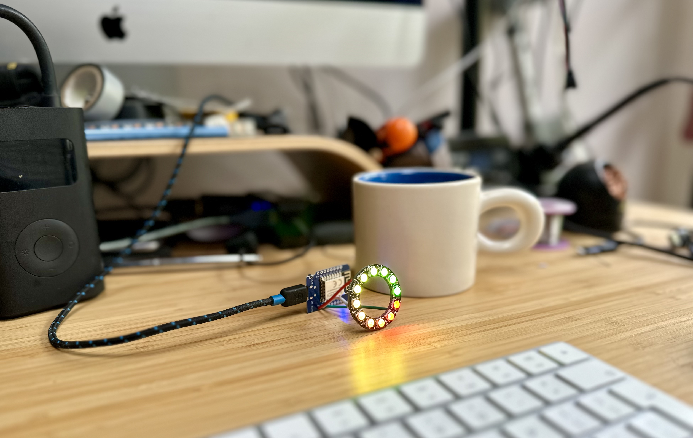
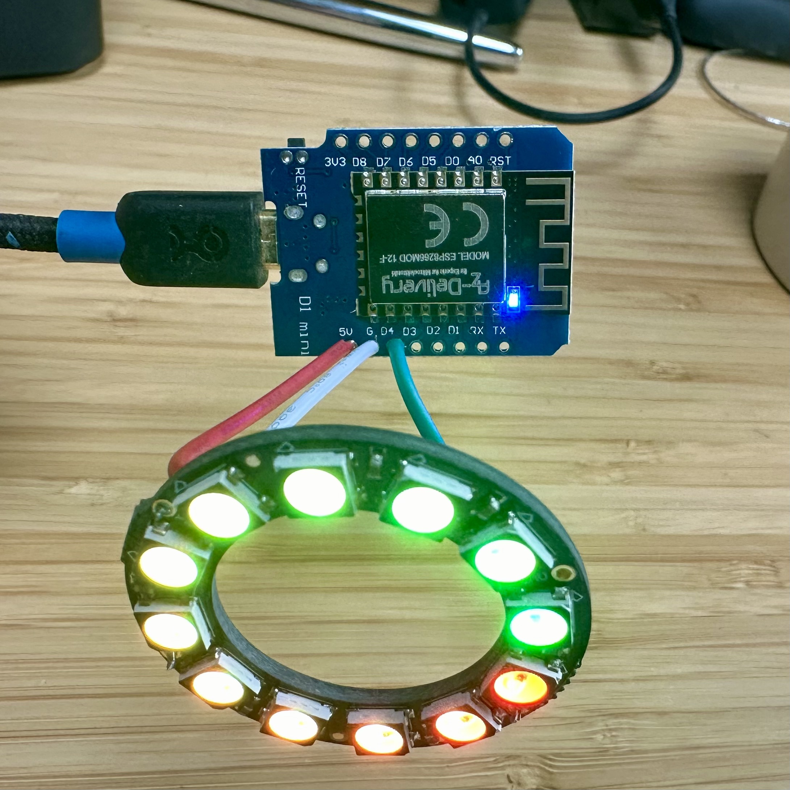

## v1 - ESP8266 D1 Mini

Some notes [on iot.io blog](https://www.iot.io/blog/2024/04/28/blinking-led.html) from original start of work

Bugs:

https://forum.arduino.cc/t/first-time-with-esp8266-getting-rst-cause-4-boot-mode-3-6-when-trying-wifi/1080419 

d1 mini ets Jan 8 2013,rst cause:4, boot mode:(3,6)

mqtt all pixels bug - turns out mqtt.setBufferSize(256); is the default behonid the scenes
increased this to mqtt.setBufferSize(2000);
https://arduinojson.org/v6/how-to/use-arduinojson-with-pubsubclient/ 
https://forum.arduino.cc/t/sending-long-strings-via-mqtt-with-one-packet/1139747/3 

