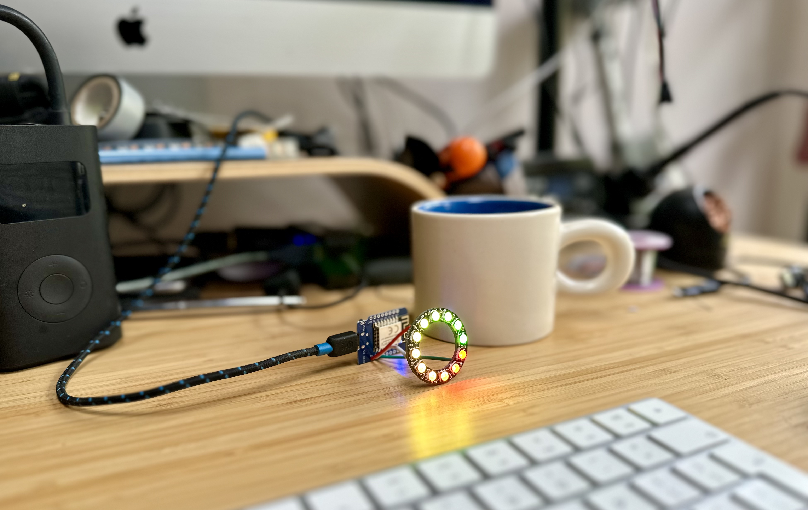
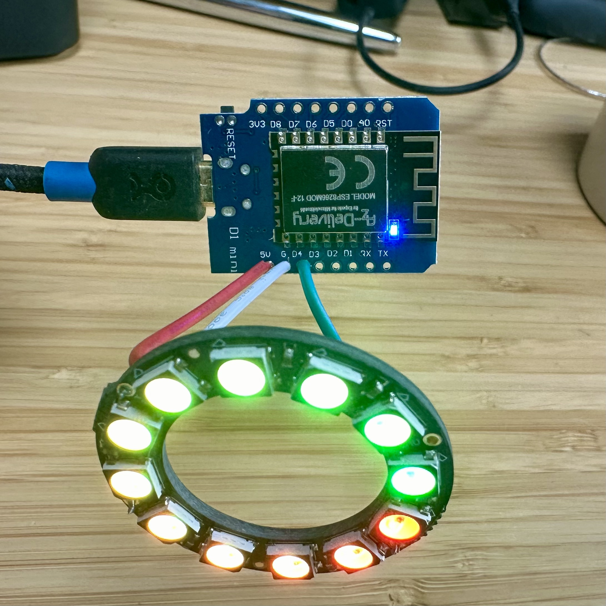

# Chrono Lumina
LED Neopixel Ring controlled via MQTT. Created for CASA0014 project work / teaching but also used as a display to show status of devices in CE Lab. 

<a data-flickr-embed="true" href="https://www.flickr.com/photos/pseudonomad/53685390366/in/datetaken/" title="Blinking Neo Pixels"></a>

## v2 - ESP32 C3

Arduino code in this [folder](d1miniesp32/d1mini_esp32_S3_zero_neopixel). Sketch uses same message structure as v1 so can be tested with same HTML page. 

Info on the [Waveshare ESP32 C3 Zero](https://www.waveshare.com/esp32-c3-zero.htm) and in the [docs folder](docs/).

### Controlling via MQTT
NeoPixels are controlled via MQTT. Each Arduino is numbered 1 to 50 and listens for messages on a topic with the following structure:

mqtt.cetools.org/student/CASA0014/light/x/

where x is the number of the device.

### Set a single pixel
Individual LED's can be controlled by sending a message to the "pixel" topic with the following format. In this case we are controlling Arduino number 2 and setting pixel 4 (of 12) to a colour value of red. Note you can also set the white led (W). All RGBW values are 0-254.

topic = student/CASA0014/light/2/pixel/
```  
{
    "pixelid": 3,
    "R": 0,
    "G": 255,
    "B": 128,
    "W": 200
}
```

### Set all pixels
To set all LED's in one go send a message to topic "all" with the following payload. Note this function fades the pixels in rather than setting them instantly.

topic = student/CASA0014/light/2/all/


```
{
  "allLEDs": [
    {
      "pixelid": 0,
      "R": 58,
      "G": 69,
      "B": 168,
      "W": 0
    },
    {
      "pixelid": 1,
      "R": 188,
      "G": 62,
      "B": 129,
      "W": 0
    },
    {
      "pixelid": 2,
      "R": 89,
      "G": 238,
      "B": 253,
      "W": 0
    },
...
...
    {
      "pixelid": 10,
      "R": 240,
      "G": 213,
      "B": 83,
      "W": 0
    },
    {
      "pixelid": 11,
      "R": 250,
      "G": 17,
      "B": 118,
      "W": 0
    }
  ]
}
```

### Change brightness

The overall brightness of the LED's can be set on the topic:

student/CASA0014/light/2/brightness/

expecting to receive a JSON packet in this format
```
{
    "brightness": 50
}
```
Note: brightness is limited to 120 via MQTT which should be bright enough!

### Other functions
A few other internal functions are used for testing the neopixels - for example:

On topic = student/CASA0014/light/2/all/

You can also send the following payloads

```
{
    "method": "clear"
}
```
This sets all LED values to 0

```
{
    "method": "allrandom"
}
```
Randomly assigns values to all pixels

```
{
    "method": "onerandom"
}
```
Randomly assigns an RGD value to a random pixel

```
{
    "method": "pulsewhite"
}
```
Stores the current pixel values, pulses all LED's white and then returns to original LED values


## HTML test page to send MQTT messages
Test page at https://www.iot.io/led/

Code in [html folder](html/led.html)


## v1 - ESP8266 D1 Mini

Some notes [on iot.io blog](https://www.iot.io/blog/2024/04/28/blinking-led.html) from original start of work

Bugs:

https://forum.arduino.cc/t/first-time-with-esp8266-getting-rst-cause-4-boot-mode-3-6-when-trying-wifi/1080419 

d1 mini ets Jan 8 2013,rst cause:4, boot mode:(3,6)

mqtt all pixels bug - turns out mqtt.setBufferSize(256); is the default behonid the scenes
increased this to mqtt.setBufferSize(2000);
https://arduinojson.org/v6/how-to/use-arduinojson-with-pubsubclient/ 
https://forum.arduino.cc/t/sending-long-strings-via-mqtt-with-one-packet/1139747/3 







